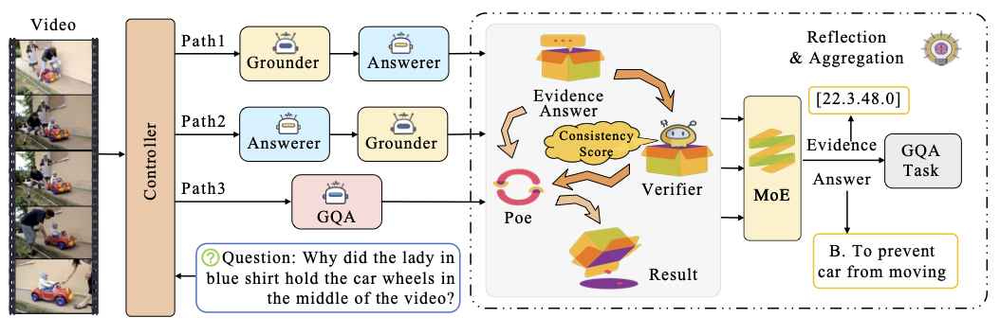

<h2 align="center">MUPA: Towards Multi-Path Agentic Reasoning for Grounded Video Question Answering</h2>


**MUPA** is a cooperative multi-path, multi-agentic framework designed for **Grounded VideoQA**, seamlessly unifying
video grounding, question answering, answer reflection and evidence aggregation.  
By running three distinct reasoning paths and a dedicated Reflection Agent that verifies and fuses their outputs, MUPA
achieves high grounding fidelity without sacrificing answer accuracy.

<p align="center">
  
</p>


## 🏆 MUPA on Public Benchmarks

| Benchmark                        | Evaluation Results (2B / 7B)              |
|----------------------------------|-------------------------------------------|
| `ZS` NExT-GQA (test)             | `Acc@GQA: 28.7/30.3` `IoP@0.5: 38.7/39.4` |
| `FT` DeVE-QA (test)              | `Acc@GQA: 43.9/47.4` `IoP@0.5: 53.3/55.2` |
| `ZS` ActivityNet-Captions (test) | `IoU@0.5: 27.2/31.3` `mIoU: 31.4/33.1`    |
| `ZS` ActivityNet-RTL (test)      | `IoU@0.5: 20.4/28.9` `mIoU: 23.2/32.0`    |
| `FT` TACoS (test)                | `IoU@0.5: 37.1/40.9` `mIoU: 34.2/37.8`    |

*“ZS” means zero-shot, “FT” means fine-tuned.

## 📦 Datasets

#### GQA (179K):

| Dataset         | Directory                                                                                              | Source Link                                                                                                                       |
|-----------------|--------------------------------------------------------------------------------------------------------|-----------------------------------------------------------------------------------------------------------------------------------|
| QVHighlights-QA | [`qvhighlights_qa`](https://huggingface.co/datasets/soughtlin/MUPA-Datasets/tree/main/qvhighlights_qa) | https://github.com/jayleicn/moment_detr                                                                                           |
| TACoS-QA        | [`tacos_qa`](https://huggingface.co/datasets/soughtlin/MUPA-Datasets/tree/main/tacos_qa)               | https://www.mpi-inf.mpg.de/departments/computer-vision-and-machine-learning/research/vision-and-language/tacos-multi-level-corpus |
| CosMo-Cap-QA    | [`cosmo_cap_qa`](https://huggingface.co/datasets/soughtlin/MUPA-Datasets/tree/main/cosmo_cap_qa)       | https://github.com/showlab/cosmo                                                                                                  |
| DeVE-QA         | [`deve_qa`](https://huggingface.co/datasets/soughtlin/MUPA-Datasets/tree/main/deve_qa)                 | https://github.com/QHUni/DeVE-QA/tree/main                                                                                        |

#### Grounder (210K):

| Dataset                  | Directory                                                                                              | Source Link                                                                                                                       |
|--------------------------|--------------------------------------------------------------------------------------------------------|-----------------------------------------------------------------------------------------------------------------------------------|
| QVHighlights             | [`qvhighlights`](https://huggingface.co/datasets/soughtlin/MUPA-Datasets/tree/main/qvhighlights)       | https://github.com/jayleicn/moment_detr                                                                                           |
| DiDeMo                   | [`didemo`](https://huggingface.co/datasets/soughtlin/MUPA-Datasets/tree/main/didemo)                   | https://github.com/LisaAnne/LocalizingMoments/                                                                                    |
| TACoS                    | [`tacos`](https://huggingface.co/datasets/soughtlin/MUPA-Datasets/tree/main/tacos)                     | https://www.mpi-inf.mpg.de/departments/computer-vision-and-machine-learning/research/vision-and-language/tacos-multi-level-corpus |
| QuerYD                   | [`queryd`](https://huggingface.co/datasets/soughtlin/MUPA-Datasets/tree/main/queryd)                   | https://www.robots.ox.ac.uk/~vgg/data/queryd/                                                                                     |
| HiREST (Grounding)       | [`hirest`](https://huggingface.co/datasets/soughtlin/MUPA-Datasets/tree/main/hirest)                   | https://github.com/j-min/HiREST                                                                                                   |
| HiREST (Step Captioning) | [`hirest`](https://huggingface.co/datasets/soughtlin/MUPA-Datasets/tree/main/hirest)                   | https://github.com/j-min/HiREST                                                                                                   |
| CosMo-Cap                | [`cosmo_cap`](https://huggingface.co/datasets/soughtlin/MUPA-Datasets/tree/main/cosmo_cap)             | https://github.com/showlab/cosmo                                                                                                  |
| InternVid-VTime          | [`internvid_vtime`](https://huggingface.co/datasets/soughtlin/MUPA-Datasets/tree/main/internvid_vtime) | https://github.com/OpenGVLab/InternVideo/tree/main/Data/InternVid                                                                 |

#### Verifier (232K):

| Dataset             | Directory                                                                                                                                                                                       | Source Link                                                                                                                       |
|---------------------|-------------------------------------------------------------------------------------------------------------------------------------------------------------------------------------------------|-----------------------------------------------------------------------------------------------------------------------------------|
| QVHighlights-Verify | [`verifying`](https://huggingface.co/datasets/soughtlin/MUPA-Datasets/tree/main/verifying), [`qvhighlights`](https://huggingface.co/datasets/soughtlin/MUPA-Datasets/tree/main/qvhighlights) | https://github.com/jayleicn/moment_detr                                                                                           |
| DiDeMo-Verify       | [`verifying`](https://huggingface.co/datasets/soughtlin/MUPA-Datasets/tree/main/verifying), [`didemo`](https://huggingface.co/datasets/soughtlin/MUPA-Datasets/tree/main/didemo)             | https://github.com/LisaAnne/LocalizingMoments/                                                                                    |
| TACoS-Verify        | [`verifying`](https://huggingface.co/datasets/soughtlin/MUPA-Datasets/tree/main/verifying),[`tacos`](https://huggingface.co/datasets/soughtlin/MUPA-Datasets/tree/main/tacos)                | https://www.mpi-inf.mpg.de/departments/computer-vision-and-machine-learning/research/vision-and-language/tacos-multi-level-corpus |

### Benchmarks

| Dataset              |       Type       | Directory                                                                                                                                                                                                           | Source Link                                                                                                                       |
|----------------------|:----------------:|---------------------------------------------------------------------------------------------------------------------------------------------------------------------------------------------------------------------|-----------------------------------------------------------------------------------------------------------------------------------|
| NExT-GQA             | Grounded VideoQA | [`nextgqa`](https://huggingface.co/datasets/soughtlin/MUPA-Datasets/tree/main/nextgqa)                                                                                                                              | https://github.com/doc-doc/NExT-GQA                                                                                               |
| DeVE-QA              | Grounded VideoQA | [`deve_qa`](https://huggingface.co/datasets/soughtlin/MUPA-Datasets/tree/main/deve_qa)                                                                                                                              | https://github.com/QHUni/DeVE-QA/tree/main                                                                                        |
| ActivityNet-Captions | Moment Retrieval | [`activitynet_captions`](https://huggingface.co/datasets/soughtlin/MUPA-Datasets/tree/main/activitynet_captions), [`activitynet`](https://huggingface.co/datasets/soughtlin/MUPA-Datasets/tree/main/ActivityNet) | https://cs.stanford.edu/people/ranjaykrishna/densevid/                                                                            |
| TACoS                | Moment Retrieval | [`tacos`](https://huggingface.co/datasets/soughtlin/MUPA-Datasets/tree/main/tacos)                                                                                                                                  | https://www.mpi-inf.mpg.de/departments/computer-vision-and-machine-learning/research/vision-and-language/tacos-multi-level-corpus |
| ActivityNet-RTL      | Moment Retrieval | [`activitynet_rtl`](https://huggingface.co/datasets/soughtlin/MUPA-Datasets/tree/main/activitynet_rtl), [`activitynet`](https://huggingface.co/datasets/soughtlin/MUPA-Datasets/tree/main/ActivityNet)           | https://github.com/NVlabs/LITA                                                                                                    |

**Notes**:

1. For some datasets (e.g., DeVe-QA), the annotations and videos are stored in different folders. All the directories
   in `Directory` need to be downloaded.
2. Use the following commands to concatenate and extract video tar splits (e.g., videos.tar.gz.00,
   videos_3fps_480_noaudio.tar.gz.00).

```
# videos.tar.gz.00, videos.tar.gz.01
cat videos.tar.gz.* | tar -zxvf -

# videos_3fps_480_noaudio.tar.gz.00, videos_3fps_480_noaudio.tar.gz.01
cat videos_3fps_480_noaudio.tar.gz.* | tar -zxvf -
```

## 🚀 Training

Our codebase supports training and evaluating
on [15 video datasets and benchmarks](https://github.com/soughtlin/MUPA/dataset/sub_classes) with the following
features.

- Flexible hardware settings: NVIDIA GPU / Ascend NPU, Single-Node / Multi-Node
- Efficient training techniques: DeepSpeed ZeRO, BF16, LoRA, SDPA, FlashAttention2, Liger-Kernel
- Customizing the base LLM and conversation templates
- Monitoring the training process via Tensorboard / Wandb
- Group sampling for mixed dataset training
- Multi-process / multi-device evaluation on public benchmarks

See [train.md](docs/train.md) for a quick start guide.

## 🔮 Evaluation

See [eval.md](docs/eval.md) for details about evaluating MUPA on public benchmarks.

## 📖 Citation

Please kindly cite our paper if you find this project helpful.

```bibtex
@inproceedings{xxx,
  title = {MUPA: Towards Multi-Path Agentic Reasoning for Grounded Video Question Answering},
  author = {Jisheng Dang, Huilin Song, Junbin Xiao, Bimei Wang, Han Peng, Haoxuan Li, Xun Yang, Meng Wang,
 Tat-Seng Chua},
  booktitle = {arXiv preprint arXiv},
  year = {2025}
}
```


